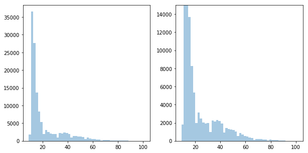
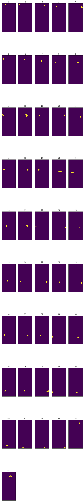
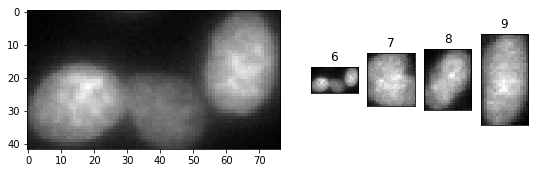

# Image-Processing
## Show Single Cell Image with pyplot

    #Import listdirectory function from OS module
    from os import listdir
    import pathlib
    import matplotlib.pyplot as plt
    import seaborn as sns
    import numpy as np
    import cv2

    #Retrieve filenames from directory
    file_list = pathlib.Path('images').glob('*/images/*.png')
    files = sorted([file for file in file_list])
    img_path = files[45]
    
    #read image
    img = cv2.imread(str(img_path))
    plt.imshow(img)
    plt.xticks([])
    plt.yticks([])

    print('Original image shape', img.shape)
    
    #transform to grayimage
    grayimg = cv2.cvtColor(img,cv2.COLOR_BGR2GRAY)
    plt.imshow(grayimg, cmap='gray')
    print('New Image Shape',grayimg.shape)

## Image Segmentation by Intensity Thresholding
    
    from skimage.filters import threshold_otsu
    #Find Threshold and Removing Background
    plt.figure(figsize=(10,5))
    plt.subplot(1,2,1)
    sns.distplot(grayimg.flatten(), kde=False)

    plt.subplot(1,2,2)
    sns.distplot(grayimg.flatten(), kde=False)
    plt.ylim(0,15000)

    thresh_value = threshold_otsu(grayimg)
    mask = np.where(grayimg > thresh_value, 1, 0)

## Create Seperate Mask for Each Cell
    from scipy import ndimage
    import math
    labels, nlabels = ndimage.label(maskimg)

    #Create seperate mask for each label and store in list
    def make_individual_masks(labels, nlabels):
        mask_list = []

        for counter, coord in enumerate(ndimage.find_objects(labels)):
            #If cell is not to small, create single mask and add to list
            cell = maskimg[coord]  
            if np.product(cell.shape) > 90:
                label_mask = np.where(labels == counter+1, 1, 0) 
                mask_list.append(label_mask)  
            else:
                continue

        return mask_list

## Compress Image Data with Run Line Encoding
